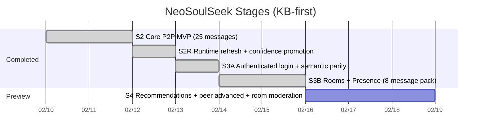
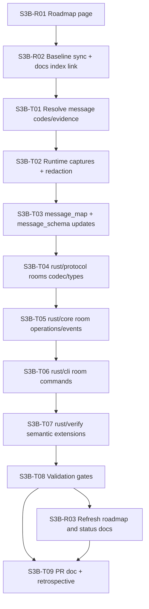

# NeoSoulSeek Roadmap

## Scope

This roadmap represents the execution path after S3A. It focuses on protocol mapping first, then incremental SDK/CLI capabilities for a custom evolvable client.

## Stage Timeline

## S3B Dependency Graph

## Stage Status Matrix

| Stage | Owner area | Status | Evidence | Next gate |
|---|---|---|---|---|
| S2 | protocol/core/cli/verify | done | `docs/state/stage2-parity-audit.md` | none |
| S2R | runtime+KB | done | `docs/verification/evidence-ledger.md` | none |
| S3A | auth+semantic verify | done | `docs/pr/0003-s3a-auth-semantic-parity.md` | S3B start |
| S3B | rooms/presence batch | done (branch scope) | `captures/redacted/login-join-room-presence/manifest.redacted.json` | S4 domain batch selection |
| S4 preview | discovery+peer advanced | preview | `docs/state/protocol-backlog.md` | finalize S3B outcomes |

## S3B Target Contract

Required 8-message pack:

1. `SM_ROOM_LIST`
2. `SM_JOIN_ROOM`
3. `SM_LEAVE_ROOM`
4. `SM_USER_JOINED_ROOM`
5. `SM_USER_LEFT_ROOM`
6. `SM_ROOM_MEMBERS`
7. `SM_ROOM_OPERATORS`
8. `SM_SAY_CHATROOM`

Confidence gate for this batch:

- `high >= 6`
- `medium <= 2`
- `low = 0`

All entries must include valid evidence links.

## S4 Preview (Not in S3B implementation)

1. Recommendations and discovery message batch.
2. Peer advanced message batch.
3. Room moderation follow-up (`SM_ADD_ROOM_MEMBER`, `SM_REMOVE_ROOM_MEMBER`).
4. Differential replay coverage expansion for the new domains.
