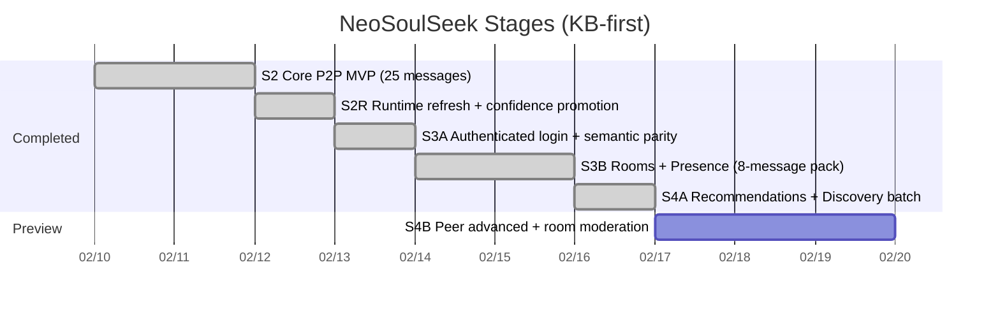
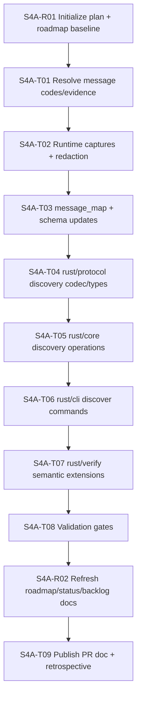

# NeoSoulSeek Roadmap

## Scope

This roadmap tracks staged execution with protocol mapping first, then incremental SDK/CLI capabilities for a custom evolvable client.

## Stage Timeline

## S4A Dependency Graph (Executed)

## Stage Status Matrix

| Stage | Owner area | Status | Evidence | Next gate |
|---|---|---|---|---|
| S2 | protocol/core/cli/verify | done | `docs/state/stage2-parity-audit.md` | none |
| S2R | runtime+KB | done | `docs/verification/evidence-ledger.md` | none |
| S3A | auth+semantic verify | done | `docs/pr/0003-s3a-auth-semantic-parity.md` | S3B start |
| S3B | rooms/presence batch | done | `docs/pr/0004-s3b-rooms-presence-roadmap.md` | S4A start |
| S4A | recommendations/discovery batch | done | `docs/pr/0005-s4a-recommendations-discovery.md` | select S4B scope |
| S4B preview | peer advanced + room moderation | preview | `docs/state/protocol-backlog.md` | approve S4B dependency graph |

## S4A Target Contract

Required 5-message pack:

1. `SM_GET_SIMILAR_TERMS`
2. `SM_GET_RECOMMENDATIONS`
3. `SM_GET_MY_RECOMMENDATIONS`
4. `SM_GET_GLOBAL_RECOMMENDATIONS`
5. `SM_GET_USER_RECOMMENDATIONS`

Confidence gate for this batch:

- `high >= 5`
- `medium <= 0`
- `low = 0`

All entries must include valid evidence links.

## S4B Preview (After S4A)

1. Peer advanced message batch.
2. Room moderation follow-up (`SM_ADD_ROOM_MEMBER`, `SM_REMOVE_ROOM_MEMBER`).
3. Differential replay coverage expansion for the new domains.
