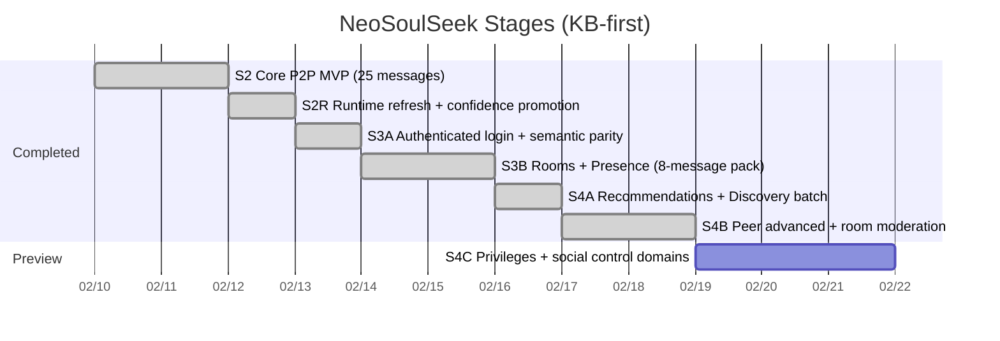
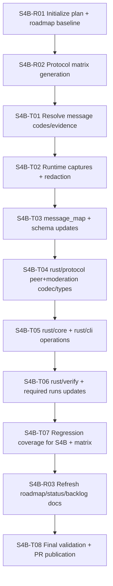

# NeoSoulSeek Roadmap

## Scope

This roadmap tracks staged execution with protocol mapping first, then incremental SDK/CLI capabilities for a custom evolvable client.

## Stage Timeline

## S4B Dependency Graph (Executed)

## Stage Status Matrix

| Stage | Owner area | Status | Evidence | Next gate |
|---|---|---|---|---|
| S2 | protocol/core/cli/verify | done | `docs/state/stage2-parity-audit.md` | none |
| S2R | runtime+KB | done | `docs/verification/evidence-ledger.md` | none |
| S3A | auth+semantic verify | done | `docs/pr/0003-s3a-auth-semantic-parity.md` | S3B start |
| S3B | rooms/presence batch | done | `docs/pr/0004-s3b-rooms-presence-roadmap.md` | S4A start |
| S4A | recommendations/discovery batch | done | `docs/pr/0005-s4a-recommendations-discovery.md` | select S4B scope |
| S4B | peer advanced + room moderation | done | `docs/pr/0006-s4b-peer-room-matrix.md` | define S4C message batch |
| S4C preview | privileges + social control domains | preview | `docs/state/protocol-backlog.md` | publish S4C dependency graph |

## S4B Target Contract

Required 9-message pack:

1. `SM_ADD_ROOM_MEMBER`
2. `SM_REMOVE_ROOM_MEMBER`
3. `SM_ADD_ROOM_OPERATOR`
4. `SM_REMOVE_ROOM_OPERATOR`
5. `PM_USER_INFO_REQUEST`
6. `PM_USER_INFO_REPLY`
7. `PM_EXACT_FILE_SEARCH_REQUEST`
8. `PM_INDIRECT_FILE_SEARCH_REQUEST`
9. `PM_UPLOAD_PLACE_IN_LINE_REQUEST`

Confidence gate for this batch:

- `high >= 7`
- `medium <= 2`
- `low = 0`

All entries must include valid evidence links.

## S4C Preview (After S4B)

1. Privileges and moderation-adjacent server controls (`SM_BAN_USER`, privilege status and grants).
2. Social-control flows (`SM_IGNORE_USER`, `SM_UNIGNORE_USER`, and related user-state notifications).
3. Additional peer domain coverage (`PM_GET_SHARED_FILES_IN_FOLDER`, `PM_SHARED_FILES_IN_FOLDER`).
