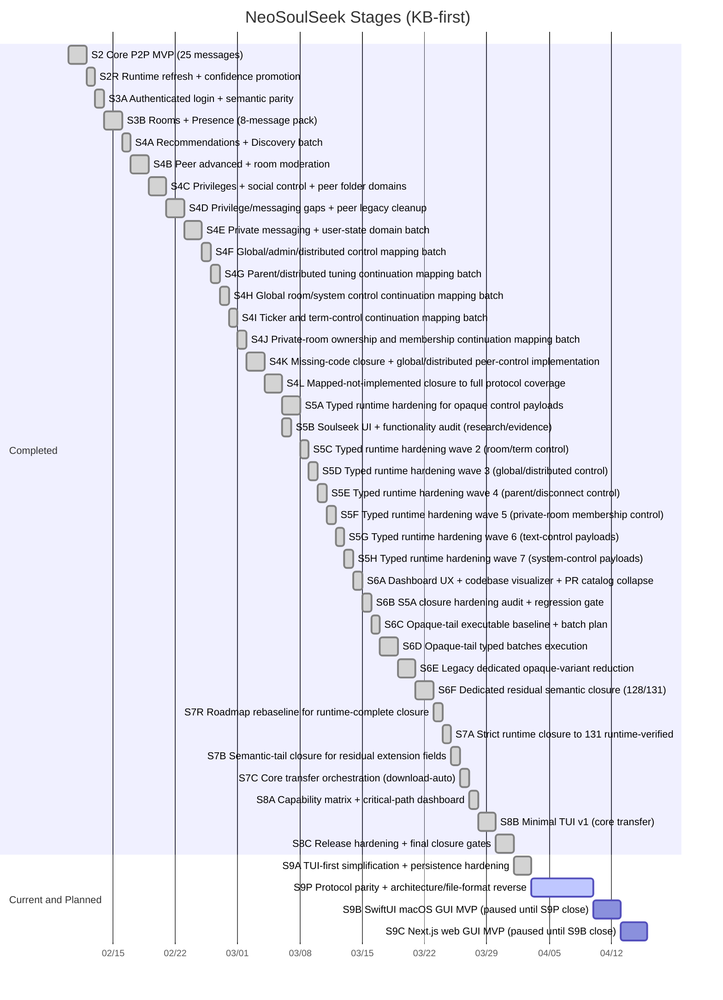
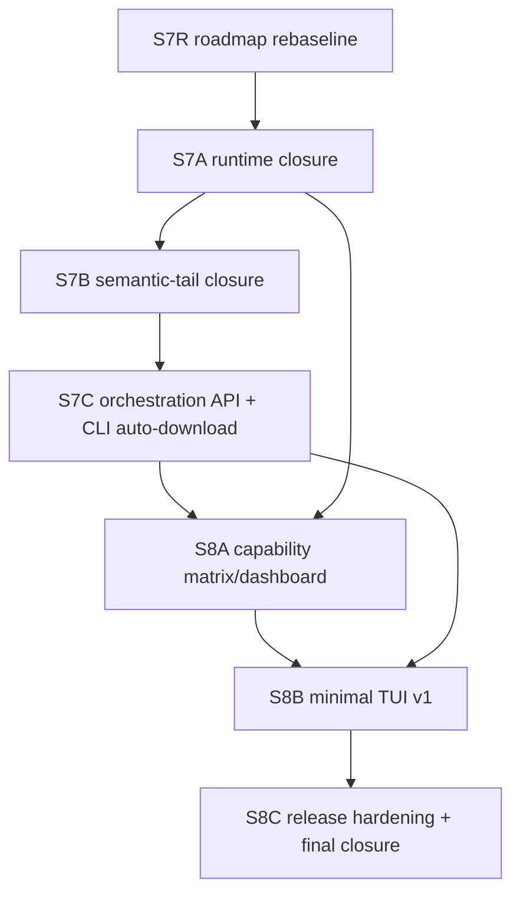
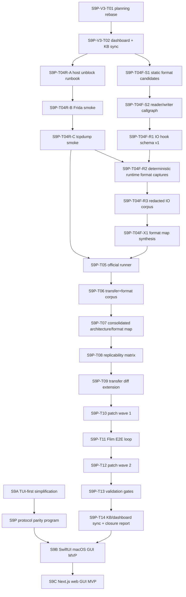
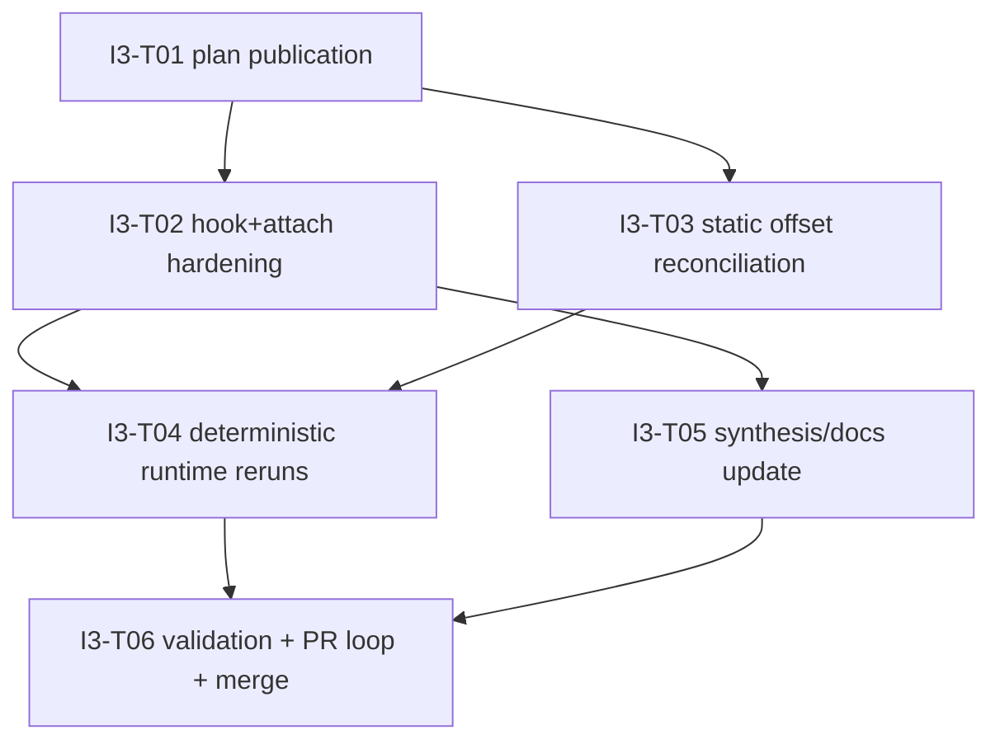
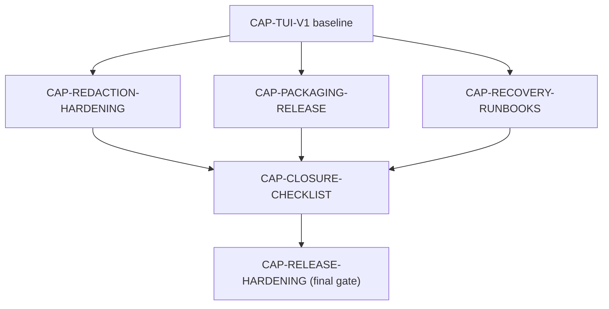

# NeoSoulSeek Roadmap

## Scope

This roadmap tracks staged execution with protocol mapping first, then runtime/static parity closure against SoulseekQt, and only then incremental GUI capabilities.

Current execution order is locked as: S9A completed baseline, S9P protocol-parity program (active), then S9B SwiftUI macOS GUI MVP, then S9C Next.js web GUI MVP.

## Visual Surfaces

- [Project Dashboard](project-dashboard.html)
- [Codebase Visualizer](codebase-visualizer/)
- [Protocol Matrix](protocol-matrix/)
- [Runtime Coverage](runtime-coverage/)
- [Capability Dashboard](capability-dashboard.html)
- [Capability Matrix](capability-matrix/)
- [Release Hardening Audit](release-hardening-audit/)
- [Final Closure Checklist](final-closure-checklist/)
- [S5A Closure Audit](s5a-closure-audit/)
- [S6 Opaque-Tail Plan](opaque-tail-plan/)

## Stage Timeline

## S7/S8 Dependency Graph

## S9 Dependency Graph

I3 execution slice (current S9P runtime-format hardening iteration):

S9P closure gates:

1. `G0-PLAN-PUBLISHED`: S9P roadmap/capabilities/dependency plan are published in state artifacts.
2. `G1-TOOLING-READY`: Frida, tcpdump, Ghidra headless, Binary Ninja, and automation prerequisites validated.
3. `G2A-STATIC-ARCH-BASELINE`: transfer/dispatch architecture baseline recovered from static evidence.
4. `G2B-STATIC-FORMAT-BASELINE`: persistence format surfaces and static reader/writer paths are mapped.
5. `G3A-RUNTIME-CAPTURE-BASELINE`: official runtime protocol scenarios are reproducible and captured/redacted.
6. `G3B-RUNTIME-FORMAT-BASELINE`: official runtime file-I/O traces and sampled payload evidence are captured/redacted.
7. `G4-FLIM-E2E-SUCCESS`: Flim E2E writes non-zero bytes.
8. `G5-TRANSFER-PARITY`: transfer semantic diff is clean for required scenarios.
9. `G6-PROTOCOL-PARITY`: scoped protocol parity matrix is closed.
10. `G7-ARCH-FORMAT-SYNTHESIS`: consolidated architecture + format map and replicability classification are complete.
11. `G8-KB-DASHBOARD-SYNC`: KB and generated dashboards are synchronized and validated.

Static vs runtime cadence:

1. Static block A (`S9P-T04S`, `S9P-T04F-S1`, `S9P-T04F-S2`): architecture + persistence format hypotheses.
2. Runtime block A (`S9P-T04R-A/B/C`, `S9P-T04F-R1/R2/R3`): host unblock + protocol/I-O capture baseline.
3. Synthesis block A (`S9P-T04F-X1`, `S9P-T07`, `S9P-T08`, `S9P-T09`): reconcile static intent vs runtime behavior.
4. Patch block A (`S9P-T10`): minimal transfer fixes for Flim critical path.
5. Runtime block B (`S9P-T11`): Flim E2E validation loops.
6. Patch block B (`S9P-T12`): queue/retry/token/P-F/timeouts parity closure.
7. Validation/reporting block (`S9P-T13`, `S9P-T14`): full gates and closure publication.

S9P tooling matrix:

1. Static analysis:
   - `/opt/homebrew/opt/ghidra/libexec/support/analyzeHeadless`
   - `scripts/ghidra_pipeline.sh`
   - `scripts/extract_search_download_flow.sh`
   - `otool`, `nm`, `strings`, `lldb`
   - `/Applications/Binary Ninja.app/Contents/MacOS/binaryninja`
   - `tools/re/extract_format_candidates.py`
   - `analysis/re/official_file_format_map.json`
   - `docs/re/static/file-format-map.md`
2. Runtime analysis:
   - `.venv-tools/bin/frida`
   - `tools/runtime/frida_capture.py`
   - `frida/hooks/soulseek_trace.js`
   - `frida/hooks/soulseek_io_trace.js`
   - `tools/runtime/capture_harness.py`
   - `scripts/capture_golden.sh`
   - `/usr/sbin/tcpdump`
   - `osascript` (primary desktop automation driver)
3. Diff/verification:
   - `scripts/run_diff_verify.sh`
   - `scripts/run_regression.sh`
   - `scripts/kb_validate.py`
   - `scripts/sync_state_dashboards.sh`
   - `rust/verify/src/lib.rs`
   - `analysis/re/protocol_parity_matrix.json`

## S8C Capability Breakdown (Completed)

Closure outcomes:

1. Ensure redacted artifacts never expose absolute path metadata or secrets.
2. Publish reproducible packaging flow for `soul-cli` and `soul-tui`.
3. Publish operator recovery runbooks for auth/search/download/TUI failures.
4. Publish executable closure audit + checklist before final gate promotion.

## S4B Dependency Graph (Executed)

## S4C Dependency Graph (Executed)

## S4D Dependency Graph (Executed)

## S4E Dependency Graph (Executed)

## Stage Status Matrix

| Stage | Owner area | Status | Evidence | Next gate |
|---|---|---|---|---|
| S2 | protocol/core/cli/verify | done | `docs/state/stage2-parity-audit.md` | none |
| S2R | runtime+KB | done | `docs/verification/evidence-ledger.md` | none |
| S3A | auth+semantic verify | done | `docs/pr/0003-s3a-auth-semantic-parity.md` | S3B start |
| S3B | rooms/presence batch | done | `docs/pr/0004-s3b-rooms-presence-roadmap.md` | S4A start |
| S4A | recommendations/discovery batch | done | `docs/pr/0005-s4a-recommendations-discovery.md` | select S4B scope |
| S4B | peer advanced + room moderation | done | `docs/pr/0006-s4b-peer-room-matrix.md` | define S4C message batch |
| S4C | privileges/social control + peer folder domains | done | `docs/pr/0007-s4c-privileges-social-peer-folder.md` | define S4D batch |
| S4D | privilege/messaging gaps + peer legacy cleanup | done | `docs/pr/0008-s4d-privilege-messaging-peer-legacy.md` | define S4E batch |
| S4E | private messaging + user-state domain batch | done | `docs/pr/0009-s4e-private-messaging-user-state.md` | define S4F batch |
| S4F | global/admin/distributed control mapping batch | done | `docs/pr/0010-s4f-global-admin-distributed-map.md` | start S4G implementation batch |
| S4G | parent/distributed tuning continuation mapping batch | done | `docs/pr/0011-s4g-parent-distributed-tuning-map.md` | start S4H implementation batch |
| S4H | global room/system control continuation mapping batch | done | `docs/pr/0012-s4h-global-system-control-map.md` | start S4I implementation batch |
| S4I | ticker and term-control continuation mapping batch | done | `docs/pr/0013-s4i-ticker-term-control-map.md` | start S4J implementation batch |
| S4J | private-room ownership and membership continuation mapping batch | done | `docs/pr/0014-s4j-private-room-ownership-map.md` | start S4K implementation batch |
| S4K | missing-code closure + global/distributed peer-control implementation | done | `docs/pr/0015-s4k-missing-code-closure-protocol-implementation.md` | start S4L implementation batch |
| S4L | mapped-not-implemented closure to full protocol coverage | done | `docs/pr/0016-s4l-mapped-not-implemented-closure.md` | start S5A typed-hardening batch |
| S5A | typed runtime hardening wave 1 | done | `docs/pr/0017-s5a-typed-runtime-hardening.md` | start S5C typed-hardening wave 2 |
| S5B | Soulseek UI + functionality exhaustive audit (research/evidence) | done | `docs/state/soulseek-feature-inventory.md` | none |
| S5C | typed runtime hardening wave 2 | done | `docs/pr/0018-s5c-typed-runtime-hardening-wave2.md` | start S5D typed-hardening wave 3 |
| S5D | typed runtime hardening wave 3 | done | `docs/pr/0019-s5d-s5h-control-typing-pack.md` | execute S5E in same pack |
| S5E | typed runtime hardening wave 4 | done | `docs/pr/0019-s5d-s5h-control-typing-pack.md` | execute S5F in same pack |
| S5F | typed runtime hardening wave 5 | done | `docs/pr/0019-s5d-s5h-control-typing-pack.md` | execute S5G in same pack |
| S5G | typed runtime hardening wave 6 | done | `docs/pr/0019-s5d-s5h-control-typing-pack.md` | execute S5H in same pack |
| S5H | typed runtime hardening wave 7 | done | `docs/pr/0019-s5d-s5h-control-typing-pack.md` | start S6 opaque-tail reduction |
| S6A | dashboard/state UX + codebase visualizer + collapsed PR catalog | done | `docs/pr/0020-s6a-dashboard-codebase-visualizer-pr-catalog.md` | start S6 opaque-tail reduction |
| S6B | executable closure gate for S5A hardening objectives | done | `docs/pr/0021-s6b-s5a-closure-hardening-audit.md` | start S6 opaque-tail reduction |
| S6C | opaque-tail executable inventory and batch plan baseline | done | `docs/pr/0022-s6c-opaque-tail-baseline-plan.md` | start S6 opaque-tail reduction |
| S6D | opaque-tail typed batches execution (S6-Batch-1/2/3) | done | `docs/pr/0023-s6d-opaque-tail-typed-batches.md` | start S6E dedicated-opaque cleanup |
| S6E | dedicated legacy opaque-variant reduction | done | `docs/pr/0024-s6e-legacy-opaque-reduction.md` | start S6F residual semantic closure |
| S6F | dedicated residual semantic closure (`128`/`131`) | done | `docs/pr/0025-s6f-residual-legacy-semantic-closure.md` | plan S7 closure/audit wave |
| S7R | roadmap rebaseline for runtime-complete closure and TUI transition | done | `docs/state/roadmap.md` | start S7A strict runtime closure |
| S7A | strict runtime closure to `verified_runtime=131` and `verified_static=0` | done | `docs/state/runtime-coverage.md` | start S7B semantic-tail closure |
| S7B | semantic-tail closure for residual extension fields | done | `analysis/protocol/message_schema.json` | start S7C orchestration flow |
| S7C | core transfer orchestration + `session download-auto` | done | `docs/runbooks/cli-download-example.md` | start S8A capability dashboard |
| S8A | capability registry/matrix + critical-path dashboard | done | `docs/state/capability-dashboard.html` | start S8B minimal TUI |
| S8B | minimal TUI v1 for core transfer workflows | done | `docs/runbooks/tui-core-transfer.md` | start S8C release hardening |
| S8C | release hardening and final v1 closure gates | done | `docs/state/verification-status.md` | post-v1 expansion roadmap |
| S9A | TUI-first simplification and persistence hardening | done | `docs/runbooks/tui-core-transfer.md` | start S9P protocol parity program |
| S9P | protocol parity + deep architecture/file-format reverse (static/runtime iterative) | in_progress | `docs/state/roadmap.md` | close G0..G8 and then unpause S9B |
| S9B | SwiftUI macOS GUI MVP on top of `soul-cli` JSON mode | planned | `docs/state/roadmap.md` | paused until S9P closure |
| S9C | Next.js web GUI MVP on top of `soul-cli` JSON mode | planned | `docs/state/roadmap.md` | paused until S9B closure |

## S4B Target Contract

Required 9-message pack:

1. `SM_ADD_ROOM_MEMBER`
2. `SM_REMOVE_ROOM_MEMBER`
3. `SM_ADD_ROOM_OPERATOR`
4. `SM_REMOVE_ROOM_OPERATOR`
5. `PM_USER_INFO_REQUEST`
6. `PM_USER_INFO_REPLY`
7. `PM_EXACT_FILE_SEARCH_REQUEST`
8. `PM_INDIRECT_FILE_SEARCH_REQUEST`
9. `PM_UPLOAD_PLACE_IN_LINE_REQUEST`

Confidence gate for this batch:

- `high >= 7`
- `medium <= 2`
- `low = 0`

All entries must include valid evidence links.

## S4C Target Contract (Executed)

Required target pack:

1. `SM_IGNORE_USER`
2. `SM_UNIGNORE_USER`
3. `SM_GET_OWN_PRIVILEGES_STATUS`
4. `SM_GET_USER_PRIVILEGES_STATUS`
5. `SM_GIVE_PRIVILEGE`
6. `SM_INFORM_USER_OF_PRIVILEGES`
7. `SM_INFORM_USER_OF_PRIVILEGES_ACK`
8. `PM_GET_SHARED_FILES_IN_FOLDER`
9. `PM_SHARED_FILES_IN_FOLDER`

Confidence gate for this batch:

- `high >= 7`
- `medium <= 2`
- `low = 0`

## S4D Target Contract (Executed)

Required new-message pack:

1. `SM_BAN_USER`
2. `SM_PRIVILEGED_LIST`
3. `SM_GET_RECOMMENDED_USERS`
4. `SM_GET_TERM_RECOMMENDATIONS`
5. `SM_GET_RECOMMENDATION_USERS`
6. `PM_INVITE_USER_TO_ROOM`
7. `PM_CANCELLED_QUEUED_TRANSFER`
8. `PM_MOVE_DOWNLOAD_TO_TOP`
9. `PM_QUEUED_DOWNLOADS`

Runtime-promotion carryover from prior stage:

1. `PM_EXACT_FILE_SEARCH_REQUEST`
2. `PM_INDIRECT_FILE_SEARCH_REQUEST`

Final confidence result for this batch:

- `high = 11`
- `medium = 0`
- `low = 0`

All entries must include valid evidence links.

## S4E Target Contract (Executed)

Required message pack:

1. `SM_MESSAGE_USER`
2. `SM_MESSAGE_ACKED`
3. `SM_GET_USER_STATUS`
4. `SM_GET_USER_STATS`
5. `SM_GET_PEER_ADDRESS`
6. `SM_CONNECT_TO_PEER`
7. `SM_MESSAGE_USERS`
8. `SM_PEER_MESSAGE`

Final confidence result for this batch:

- `high = 8`
- `medium = 0`
- `low = 0`

Runtime scenarios added:

1. `login-private-message`
2. `login-user-state`
3. `login-peer-address-connect`
4. `login-message-users`
5. `login-peer-message`

## S5D-S5H Completion Snapshot

Execution result:

1. Promoted `23` control-message families from opaque to typed payloads with runtime evidence.
2. Added runtime-authenticated scenarios:
   - `login-global-room-control`
   - `login-parent-disconnect-control`
   - `login-private-room-membership-control`
   - `login-text-control`
   - `login-system-control`
3. Reduced generic opaque control bucket from `34` to `15` codes while preserving full protocol matrix closure.

## S6 Completion Snapshot

1. Executed S6 batches and promoted the generic opaque-tail closure set to typed payload coverage:
   - Batch 1: `41`, `61`, `67`, `70`
   - Batch 2: `71`, `73`, `82`, `93`, `102`
   - Batch 3: `114`, `115`, `116`, `138`, `141`, `142`
2. `OPAQUE_SERVER_CONTROL_CODES` generic closure is now `0`.
3. Protocol matrix closure remains preserved (`implemented+mapped=131`) with semantic diff parity intact.

## S6F Completion Snapshot

1. Closed dedicated residual semantics for `SM_DNET_DELIVERY_REPORT` (`128`) and `SM_FLOOD` (`131`) using authenticated runtime multi-value probes.
2. Promoted both codes to typed payload handling in `rust/protocol` with optional `u32 + raw_tail` layouts.
3. Preserved matrix closure (`implemented+mapped=131`) and semantic differential parity gates.

## S5B Target Contract (Executed)

Objective:

1. Produce a complete SoulseekQt UI + functionality inventory with evidence-backed mappings.
2. Run a second-pass audit that revisits every mapped feature and marks `verified_pass2` or `gap_found`.
3. Update reverse/decompilation docs with UI-handler-to-protocol bridge anchors.

Final status:

- Master inventory published: `docs/state/soulseek-feature-inventory.md`
- Pass-2 review coverage: `42/42` feature entries revisited.
- Gap count: `1` (`macOS assistive-access denied while trying live menu extraction`; static fallback documented).
