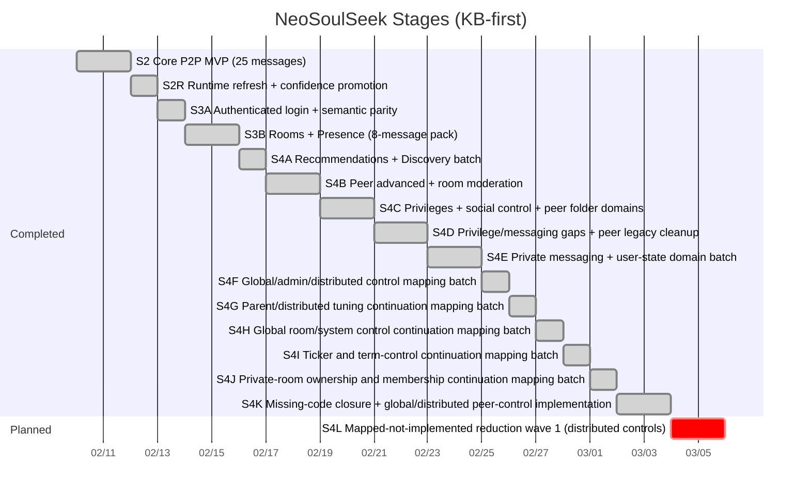

# NeoSoulSeek Roadmap

## Scope

This roadmap tracks staged execution with protocol mapping first, then incremental SDK/CLI capabilities for a custom evolvable client.

## Stage Timeline

## S4B Dependency Graph (Executed)

## S4C Dependency Graph (Executed)

## S4D Dependency Graph (Executed)

## S4E Dependency Graph (Executed)

## Stage Status Matrix

| Stage | Owner area | Status | Evidence | Next gate |
|---|---|---|---|---|
| S2 | protocol/core/cli/verify | done | `docs/state/stage2-parity-audit.md` | none |
| S2R | runtime+KB | done | `docs/verification/evidence-ledger.md` | none |
| S3A | auth+semantic verify | done | `docs/pr/0003-s3a-auth-semantic-parity.md` | S3B start |
| S3B | rooms/presence batch | done | `docs/pr/0004-s3b-rooms-presence-roadmap.md` | S4A start |
| S4A | recommendations/discovery batch | done | `docs/pr/0005-s4a-recommendations-discovery.md` | select S4B scope |
| S4B | peer advanced + room moderation | done | `docs/pr/0006-s4b-peer-room-matrix.md` | define S4C message batch |
| S4C | privileges/social control + peer folder domains | done | `docs/pr/0007-s4c-privileges-social-peer-folder.md` | define S4D batch |
| S4D | privilege/messaging gaps + peer legacy cleanup | done | `docs/pr/0008-s4d-privilege-messaging-peer-legacy.md` | define S4E batch |
| S4E | private messaging + user-state domain batch | done | `docs/pr/0009-s4e-private-messaging-user-state.md` | define S4F batch |
| S4F | global/admin/distributed control mapping batch | done | `docs/pr/0010-s4f-global-admin-distributed-map.md` | start S4G implementation batch |
| S4G | parent/distributed tuning continuation mapping batch | done | `docs/pr/0011-s4g-parent-distributed-tuning-map.md` | start S4H implementation batch |
| S4H | global room/system control continuation mapping batch | done | `docs/pr/0012-s4h-global-system-control-map.md` | start S4I implementation batch |
| S4I | ticker and term-control continuation mapping batch | done | `docs/pr/0013-s4i-ticker-term-control-map.md` | start S4J implementation batch |
| S4J | private-room ownership and membership continuation mapping batch | done | `docs/pr/0014-s4j-private-room-ownership-map.md` | start S4K implementation batch |
| S4K | missing-code closure + global/distributed peer-control implementation | done | `docs/pr/0015-s4k-missing-code-closure-protocol-implementation.md` | start S4L implementation batch |
| S4L | mapped-not-implemented reduction wave 1 (distributed controls) | planned | `docs/state/protocol-backlog.md` | start S4L plan |

## S4B Target Contract

Required 9-message pack:

1. `SM_ADD_ROOM_MEMBER`
2. `SM_REMOVE_ROOM_MEMBER`
3. `SM_ADD_ROOM_OPERATOR`
4. `SM_REMOVE_ROOM_OPERATOR`
5. `PM_USER_INFO_REQUEST`
6. `PM_USER_INFO_REPLY`
7. `PM_EXACT_FILE_SEARCH_REQUEST`
8. `PM_INDIRECT_FILE_SEARCH_REQUEST`
9. `PM_UPLOAD_PLACE_IN_LINE_REQUEST`

Confidence gate for this batch:

- `high >= 7`
- `medium <= 2`
- `low = 0`

All entries must include valid evidence links.

## S4C Target Contract (Executed)

Required target pack:

1. `SM_IGNORE_USER`
2. `SM_UNIGNORE_USER`
3. `SM_GET_OWN_PRIVILEGES_STATUS`
4. `SM_GET_USER_PRIVILEGES_STATUS`
5. `SM_GIVE_PRIVILEGE`
6. `SM_INFORM_USER_OF_PRIVILEGES`
7. `SM_INFORM_USER_OF_PRIVILEGES_ACK`
8. `PM_GET_SHARED_FILES_IN_FOLDER`
9. `PM_SHARED_FILES_IN_FOLDER`

Confidence gate for this batch:

- `high >= 7`
- `medium <= 2`
- `low = 0`

## S4D Target Contract (Executed)

Required new-message pack:

1. `SM_BAN_USER`
2. `SM_PRIVILEGED_LIST`
3. `SM_GET_RECOMMENDED_USERS`
4. `SM_GET_TERM_RECOMMENDATIONS`
5. `SM_GET_RECOMMENDATION_USERS`
6. `PM_INVITE_USER_TO_ROOM`
7. `PM_CANCELLED_QUEUED_TRANSFER`
8. `PM_MOVE_DOWNLOAD_TO_TOP`
9. `PM_QUEUED_DOWNLOADS`

Runtime-promotion carryover from prior stage:

1. `PM_EXACT_FILE_SEARCH_REQUEST`
2. `PM_INDIRECT_FILE_SEARCH_REQUEST`

Final confidence result for this batch:

- `high = 11`
- `medium = 0`
- `low = 0`

All entries must include valid evidence links.

## S4E Target Contract (Executed)

Required message pack:

1. `SM_MESSAGE_USER`
2. `SM_MESSAGE_ACKED`
3. `SM_GET_USER_STATUS`
4. `SM_GET_USER_STATS`
5. `SM_GET_PEER_ADDRESS`
6. `SM_CONNECT_TO_PEER`
7. `SM_MESSAGE_USERS`
8. `SM_PEER_MESSAGE`

Final confidence result for this batch:

- `high = 8`
- `medium = 0`
- `low = 0`

Runtime scenarios added:

1. `login-private-message`
2. `login-user-state`
3. `login-peer-address-connect`
4. `login-message-users`
5. `login-peer-message`

## S4L Preview (Not Started)

Target focus for the next stage:

1. Convert mapped-not-implemented distributed-control messages into typed protocol payloads (`SM_COMMAND`, `SM_ADMIN_MESSAGE`, `SM_GLOBAL_USER_LIST`, `SM_SEND_DISTRIBUTIONS`, `SM_NOTE_PARENT`, `SM_CHILD_PARENT_MAP`, `SM_DNET_MESSAGE`, `SM_DNET_RESET`).
2. Convert mapped-not-implemented parent tuning controls (`SM_SET_PARENT_MIN_SPEED`, `SM_SET_PARENT_SPEED_CONNECTION_RATIO`, `SM_SET_PARENT_INACTIVITY_BEFORE_DISCONNECT`, `SM_SET_SERVER_INACTIVITY_BEFORE_DISCONNECT`, `SM_NODES_IN_CACHE_BEFORE_DISCONNECT`, `SM_SET_SECONDS_BEFORE_PING_CHILDREN`, `SM_CAN_PARENT`, `SM_POSSIBLE_PARENTS`).
3. Reduce matrix `mapped_not_implemented` from `40` while preserving runtime redaction and semantic verification discipline.
